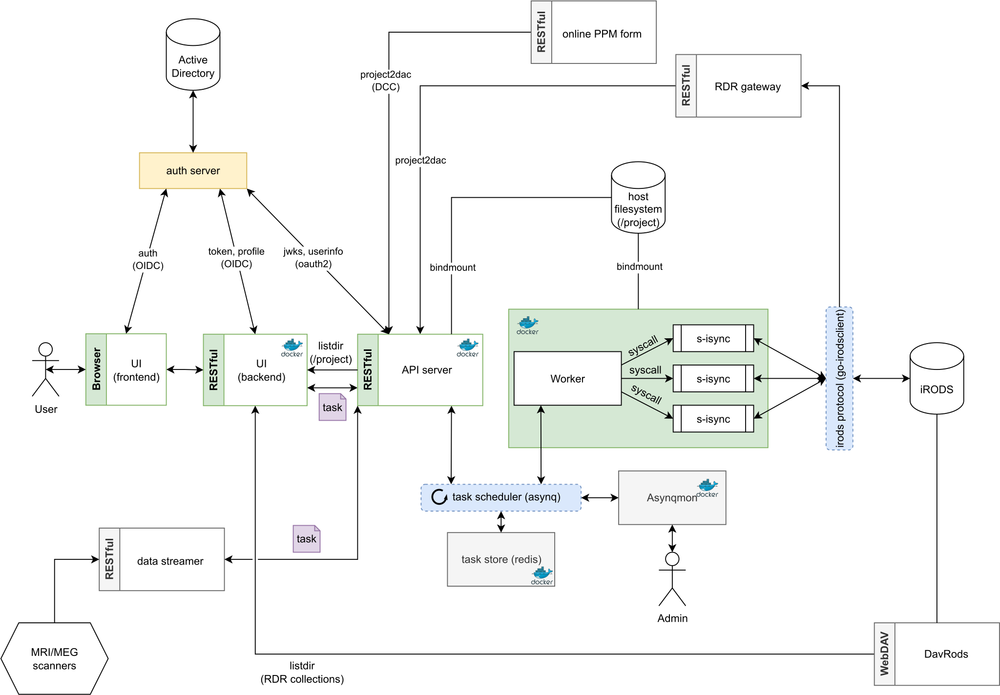

# Data Stager

An efficient data transfer service for transferring data between the work-in-progress storage at DCCN and the Radboud Data Repository.

__Note:__ it is a rewrite of the [DCCN data-stager](https://github.com/Donders-Institute/data-stager) in Golang.

## Architecture



Task is in a JSON document like the one below.

```json
{
  "drPass": "string",
  "drUser": "string",
  "dstURL": "string",
  "srcURL": "string",
  "stagerUser": "string",
  "timeout": 0,
  "timeout_noprogress": 0,
  "title": "string"
}
```

Task is submitted to the _API server_ and dispatched to a distributed _Worker_.  The task scheduler is implemeted with the [asynq](https://github.com/hibiken/asynq) Go library.  Administrators can manage the tasks through the WebUI [Asynqmon](https://github.com/hibiken/asynqmon).

For each transfer, the _Worker_ spawns a child process as the `stagerUser` to execute a CLI program called [s-isync](internal/s-isync) which performs data transfer between the local filesystem and iRODS.  When interacting with iRODS, `s-isync` makes use of the [go-irodsclient](https://github.com/cyverse/go-irodsclient) Go library.

## Build the containers

Containers of _API server_ and _Worker_ can be built with the command below:

```bash
$ docker-compose build
```

## Environment variables

Some of the supported environment variables are listed in [env.sh](env.sh).
